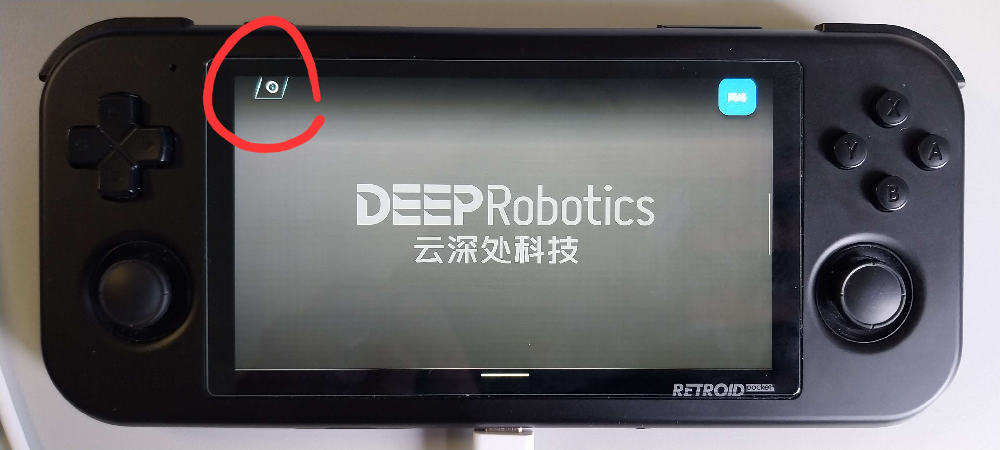
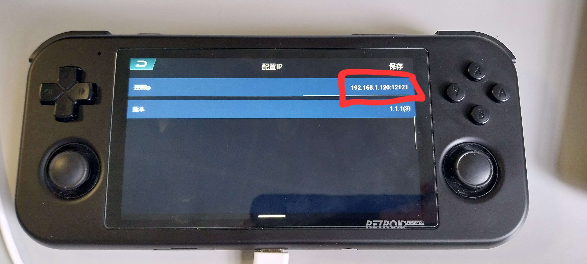
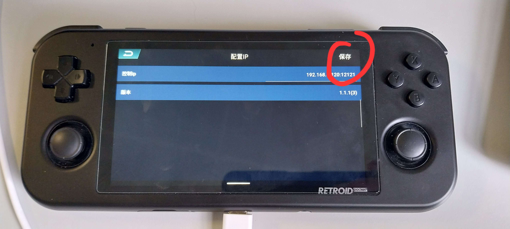
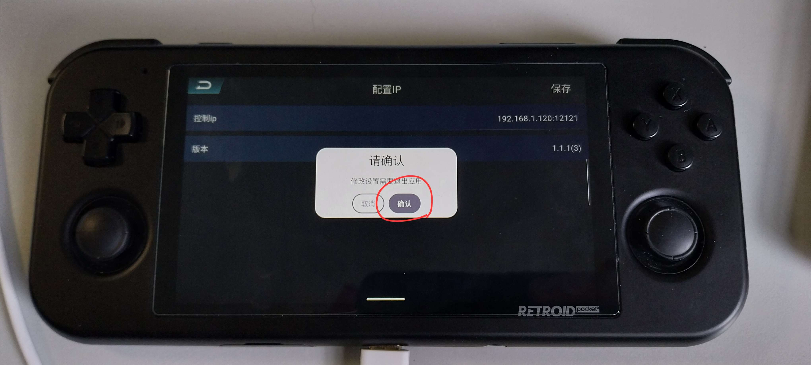

# gamepad Instructions

Ce repo est un fork du repo originel de DeepRobotics.
Il est ici pour expliquer en français et clarifier la prise en main du Retroid Gamepad pour mon stage.
Le code de ce repo est identique à celui de repo originel, je n'ai modifié aucun code.

Voici les ips des machines sur le wifi du Lite3:
- 192.168.1.120 : Ordinateur embarqué du Lite3 (communique avec le matériel et lance les programmes)
- 192.168.1.100 : Ordinateur de développement (celui avec lequel on développe les applications, ordinateur sur lequel vous lisez ceci)

Pour utiliser le retroid gamepad avec le repo https://github.com/Rav3nPho3nix/Lite3_rl_deploy, faites simplement l'[etape 2](#2-configuration-réseau-du-retroid-gamepad).

Les commandes ci dessous exécutent le programme `./example/example_retroid` afin de vérifier la bonne communication UDP.
<br>

## 1 Obtention du code
```bash
git clone --recurse-submodules https://github.com/Rav3nPho3nix/gamepad.git
```

## 2 Configuration réseau du Retroid Gamepad
Tout d'abord, le retroid gamepad doit être connecté au Wifi du Lite3.
Le nom et mot de passe du Wifi sont sur le torse du Lite3.

* Sur le retroid gamepad doit se trouver une application ayant comme icone l'icone de Flutter (comme ceci) :

<em>Si vous ne possedez pas cette application, le fichier apk est présent dans ce repo [ici](/controlapp.apk).</em>

* Lancez l'application.

A ce moment là, vous êtes sensé voir un fond gris sur lequel est écrit "DeepRobotics" (voir sur la photo suivante).

* Allez sur l'icone en haut à gauche :


* Entrez-y l'IP de l'ordinateur embarqué du Lite3 (pour moi `192.168.1.120`) avec le port `12121` (si ce port est déja utilisé, modifiez le fichier `./example/example_retroid.cpp`). Si l'IP et le port correspondent avec les miens, vous devriez obtenir ceci :


* Apppuyez sur le bouton en haut à droite de cet écran afin d'ouvrir un menu de validation :


* Appuyez sur le bouton de droite (le noir), cela va vous faire quitter l'application afin d'enregistrer vos modifications. Une fois fait, re-ouvrez l'application et vérifiez que l'IP et le port sont bien à jour :


## 3 Envoi du code

* Trouvez le nom d'utilisateur et le mot de passe de votre Lite3 en suivant les instructions suivantes: https://github.com/DeepRoboticsLab/Lite3_MotionSDK#4-identify-the-motion-host-address-username-and-code . Pour moi, l'utilisateur est `firefly` et le mot de passe est aussi `firefly`.

* Envoyez ce repo vers l'ordinateur embarqué du Lite3 (placez vous dans le répertoire parent de `gamepad`):
```bash
scp -r gamepad/ firefly@192.168.1.120:~/gamepad
```

## 4 Connexion a l'ordinateur de bord du Lite3

* Une fois l'envoi du code fait, connectez vous en ssh sur l'ordinateur embarqué avec les mêmes identifiants.

## 5 Compilation
Après connexion sur l'ordinateur embarqué du Lite3, faites ceci pour compiler le programme d'exemple :
```bash
cd ~/gamepad
mkdir build
cd build
cmake .. -DBUILD_EXAMPLE=ON
make -j
```

## 6 Execution
```bash
./example/example_retroid
```

Vous devriez obtenir dans le terminal un affichage dynamique des touches préssées en temps réel. Amusez vous à vérifier que toutes les touches fonctionnent correctement.

**En dessous de cette ligne se trouve la documentation du repo github original.**

-------------------------------------------------------

This project enables listening for physical button trigger events on the gamepad via UDP communication on the remote host. Developers can use this project to obtain real-time triggering information of physical buttons on the controller and develop your own robot remote control programs based on this information.

## 1 Code Download and Compilation
Clone the code repository onto the development PC and compile it:
```bash
git clone --recurse-submodules https://github.com/DeepRoboticsLab/gamepad.git
mkdir build && cd build
cmake .. -DBUILD_EXAMPLE=ON
make -j4
```
**[Caution]** The program listens for controller data on port 12121 by default. Please ensure that the port is not being used by other programs. If needed, you can modify the port number by opening the corresponding file in the `/example` directory:
- For the Jueying Lite3 controller, modify example_retroid.cpp
- For the Jueying X30 controller, modify example_skydroid.cpp

```c++
//Using example_retroid.cpp as an example
int main(int argc, char* argv[]) {
  RetroidGamepad rc(12121); 
  //RetroidGamepad rc( Port number for receiving handlebar commands )
  InitialRetroidKeys(rc);
  ......
}
```
After modifying the port number in the respective file, you can proceed with compiling the program.

&nbsp;
## 2 Program Execution
- Both the Lite3 and X30 official controller come with the `controlapp.apk` pre-installed. After installation, The interface after installation is shown in the figure below:

   

- Connect the controller to the development PC's network, then open the app. Click the button in the top-left corner to configure the IP address of the development PC that needs to be connected and the port number for the program to receive controller data. The image below uses the Lite3 official controller Retroid as an example.
   <p align="center"></p>
   <p align="center">App display interface</p>

   <p align="center">  </p>

   <p align="center">IP configuration interface</p>

- Run the Program:
   - Jueying Lite3 controller:
      ```bash
      cd build/
      ./example/example_retroid
      ```
   - Jueying X30 controller:
      ```bash
      cd build/
      ./example/example_skydroid
      ```
- Press the physical buttons on the controller, and the terminal will display the trigger information of the controller's physical buttons:

   <p align="center"></p>

   <p align="center">Skydroid controller communication successful display interface</p>

   <p align="center"></p>

   <p align="center">Retroid controller communication successful display interface</p>


